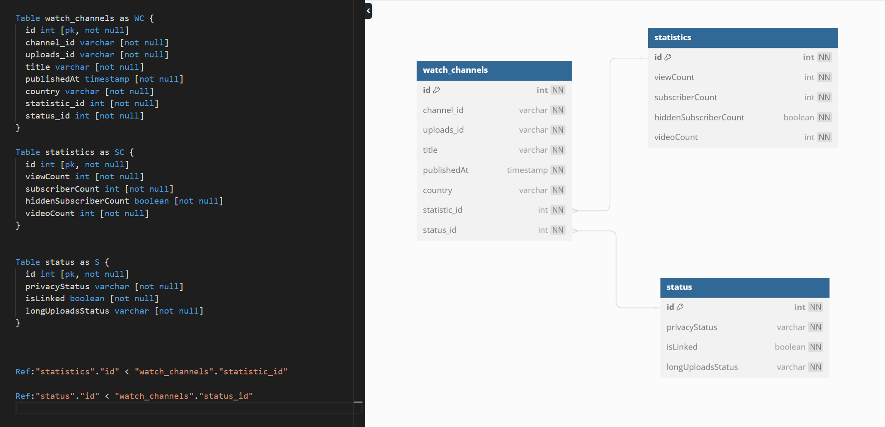

- to setup notification connected:
    - setup flask webhook server
    - download & install ngrok. run the port of flask. get the callback_url

- to get webhook handshake:
    - in server side, get and reply the hub.challenge. by accessing LocalProxy class request by the method : .args.get.
    - in the google pubsubhubbub Hub: fill the callback_url and topic_url with target channel_id
        - https://developers.google.com/youtube/v3/guides/push_notifications 

figure out another with retrieve youtube api:
- list channel by chanel_id, show part of contentDetails. cached the upload_playlist_id
- list all the video by listing playlistitems by that upload_playlist_id
- store all the video to database with table name of the chanel_id/name
- compare the new retrieve and existing db, we will get the new-uploaded video.

schema:yt
https://dbdiagram.io/

