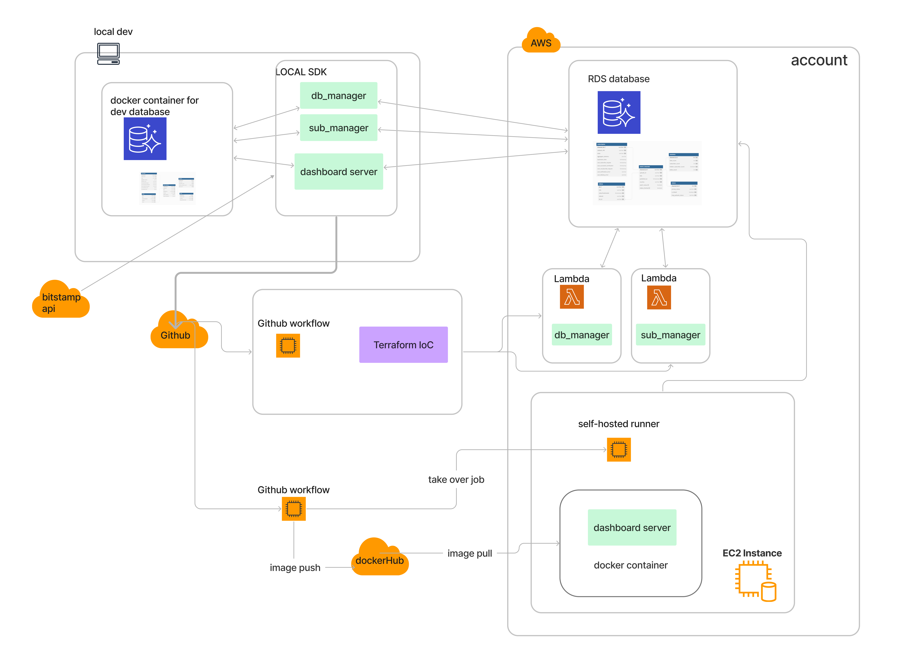
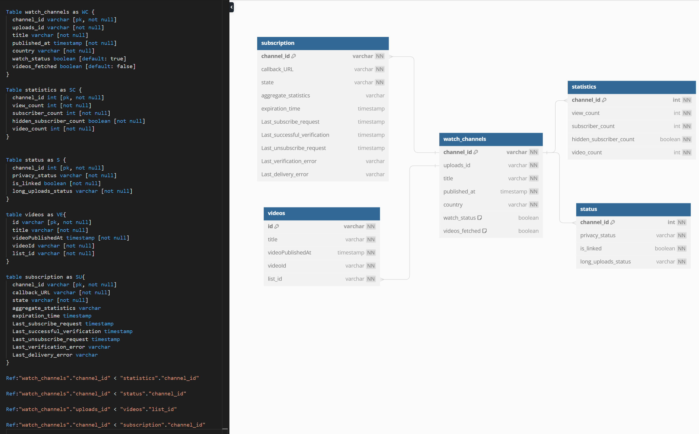

# Youtebe crypto index (YCI) 
- It stands for the how many crypto ralated video published on youtube within the unit period.
- It can be used for gauging sentiment in the retail crypto market. index wont reflect the deleted videos before the time point of data initial loading.
- dashboard currently display the latest video and index with bitcoin price. [dashboard link](http://13.41.65.150:8050).
- the data is sourced by youtube data api v3. the new video notificaion is bridged from google PubSubHubbub.
- database is on aws RDS, includes 500+ channels. 337k+ videos.
the data potentially can be used for NLP analysis for a better sentiment result in future.


## structure:


## database design:
 


consists of following parts: 
- 1: db_manager: fetch the existing data from API and store to database accordingly.
- webhook_server: receiving and responding feed of the new video notification
- 2: sub_manager : managment of channels subscription. 
- 3: dashboard: integrated server including functions:
    - webhook server receiving and responding feed of the new video notification
    - dash server for data virsulization.
- 4: deployment: build CICD pipe for above 1-3 parts to AWS cloud.

once we had big enough quality data, we potential can build extra features for NLP/ML in the future. 

guidance for colabrators:
# 1. db_manager 
- clone the repo
- create enviroment params file: src/.env. config it as src/.env.example:
    - create your own google api key for google_api_key (enable youtube bigdata v3 and create key)
    - config when you have your postgres database ready, otherwise comment out: RDS_DB_NAME. RDS_USERNAME. RDS_PASSWORD. RDS_HOSTNAME. RDS_PORT

- setup docker for dev&testing:  
    - make sure running docker application. for dev stage with local-dev-d    - spin up the container by CLI ``` docker-compose -f ./src/docker-compose-dev.yaml up -d```
    - make sure dev db use port 5432, testing db use port 5433.
    - if docker command not found. try to refresh in desktop application.
    - for checking the background container: ``` docker ps```
    - for stopping the container at the end:``` $ docker-compose -f ./src/docker-compose-dev.yaml down ```

- config in db_manager.py:
    - reset_db_only: only turn it on when needing to reset database and run src/db_manager.py
    - work_on_remote_db: #only turen is on after config the real postgres database and work on it. otherwise its defaulty set to work with local-dev-db container.
    - db_init: only turn it on for the 1st run. it will rebuild tables and fetching all data from youtube api.
    - channel_pages_to_search: amount of channels to fetch when searching. No=page*maxResult(its set as 5 defaulty now)
    - q: keyword to search for channels
    - maxResults_channels: max result for each search page of channels (1-50)
    - maxResults_videos: max result for each search page of videos (1-50)

- run following, it setup database and populate channals and videos data into relavent tables. Caution: it will take your api quota and time depends on your configuration.
    - ```python src/db_manager.py```

# 2. sub_manager
- dev config:
    - callback_url: get it from ngrok terminal+/feed
    - work_on_remote_db: #only turen is on after config the real postgres database and work on it. otherwise its defaulty set to work with local-dev-db container.
- it designed to run hourly to check the expiring channels.  
    - for dev&testing to run locally hourly: uncomment line 243-248 
    - it run once for prod. got to use event trigger on AWS when deploy
- run by :```python src/sub_manager.py``` 
# 3. dashboard
- config webhook for local dev
    - setup ngrok with credential,run it for port 8050. 
    - config in webhook_server.py:
        - work_on_remote_db: #only turen is on after config the real postgres database and work on it. otherwise its defaulty set to work with local-dev-db container.
    - run server by :```python src/dashboard.py``` 

# 4. deployment
- add 7 secrets into action:

- add runner:
    - ec2:
        - sudo apt update
        - sudo apt-get upgrade -y
        - copy paste runner code from setting/Add new self-hosted runner
        - install docker in ec2  (https://docs.docker.com/engine/install/ubuntu/)
        - login docker account sudo su -> docker login> put username and password -> exit
        - fix docker group if meeting permission deny issus (https://docs.docker.com/engine/install/linux-postinstall/#manage-docker-as-a-non-root-user)
        - ./run.sh to make ec2 to github connected up. or ./run.sh & run at background


after check cd.yml run fine. check docker ps running fine at background.
- sudo apt install nginx
- find docker container ip address (https://www.freecodecamp.org/news/how-to-get-a-docker-container-ip-address-explained-with-examples/) default@ 172.17.0.2
- edit nginx config:
    - cd /etc/nginx/sites-available/
    - sudo nano default -> add 'proxy_pass http://container-ip:container-export-port ; ' to 'location'
    - sudo restart nginx: systemctl restart nginx

- make sure security group good for access

- change the callback_url in sub_manager to ec2 public ip+'/feed'

- work on sub branch everytime. merge to main it will deployed to the ec2 container. be live.

# reason of the design
- there are a few ways to approach the video info fetching:
    - youtube api:
        - it has 10000 quota limit everyday. searching cost 100(max 50/page), extremely high. listing cost 1-2(max 50/page). such limit does not allow us for big volumn searching in high frenquent. its Inefficient.
            - ref: https://developers.google.com/youtube/v3/determine_quota_cost
    - push notification from google pubsubhubbub (https://developers.google.com/youtube/v3/guides/push_notifications)
        - it has no quota limit.
        - it pushes the notification for 3 actions: 
            - publish new videos
            - admend of title
            - admend of description
        - the problem is the we can not know which action is about from the notification.
        - as long as we have database from db_manager. we can eaily know if its the action we are monitoring.
        - it's really a pain here as very lacking documentation. 
        - subscription defaulty expiry in 5 days. it can be renewed anytime to extend the expiry date.
        
    - web scrape 
        - can not be borthered. lack of knowledge. but its open mind for other solution.

# backlog:
- blFlask==2.1.3
- Werkzeug==2.2.2 
- can not pass the security check . comment out for now. 
- if upgrade their verision docker container wont run for :
TypeError: LocalProxy.__init__() got an unexpected keyword argument 'unbound_message'
